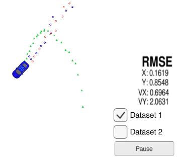

# Extended Kalman Filter Project Starter Code
Self-Driving Car Engineer Nanodegree Program

## Runs
### Dataset 1

### Dataset 2

There seems to be a source of error in the sampled data around 2/3s of the track for Dataset 1 that ruins the RMSE values. You can see how these values tend to decrease from a relative high value at start, then jump up around 2/3s.

## Additional info
### Building the code
1. mkdir build
2. cd build
3. cmake ..
4. make
5. ./ExtendedKF

#### INPUT: values provided by the simulator to the c++ program

["sensor_measurement"] => the measurement that the simulator observed (either lidar or radar)

#### OUTPUT: values provided by the c++ program to the simulator

["estimate_x"] <= kalman filter estimated position x
["estimate_y"] <= kalman filter estimated position y
["rmse_x"]
["rmse_y"]
["rmse_vx"]
["rmse_vy"]

### Other Important Dependencies

* cmake >= 3.5
  * All OSes: [click here for installation instructions](https://cmake.org/install/)
* make >= 4.1 (Linux, Mac), 3.81 (Windows)
  * Linux: make is installed by default on most Linux distros
  * Mac: [install Xcode command line tools to get make](https://developer.apple.com/xcode/features/)
  * Windows: [Click here for installation instructions](http://gnuwin32.sourceforge.net/packages/make.htm)
* gcc/g++ >= 5.4
  * Linux: gcc / g++ is installed by default on most Linux distros
  * Mac: same deal as make - [install Xcode command line tools](https://developer.apple.com/xcode/features/)
  * Windows: recommend using [MinGW](http://www.mingw.org/)
  
#### source https://github.com/nicochristie/Udacity_CarND_P4.git
